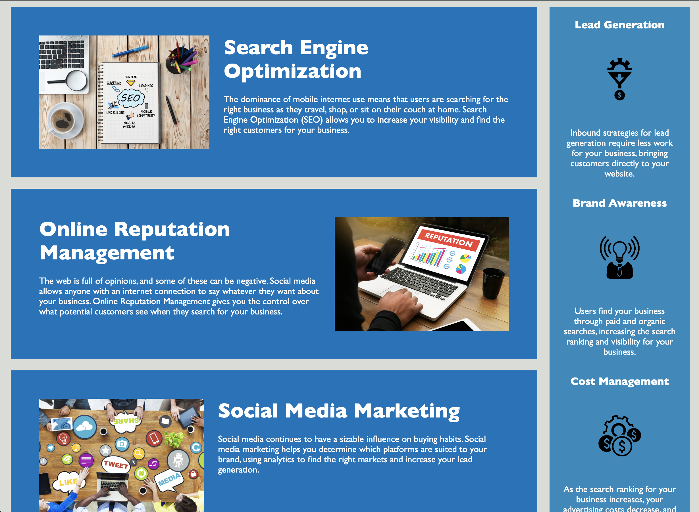

# code-refactor-6-21
Project to refactor code for the Horiseon Website. This included consolidating CSS selectors and making the website more accessible by using semantic elements and alt tags, etc. 

Horiseon's website explains the company's services and the benefits a client could experience from utilizing their services.

Deployed application can be found here: 
https://egodschalk.github.io/code-refactor-6-21/

